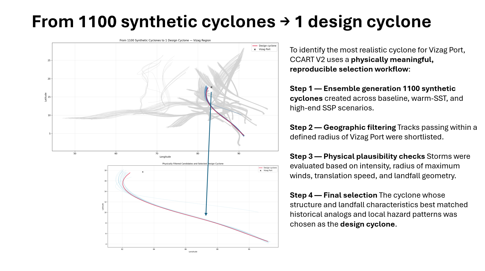

# 🌪️ Case Study: Selecting a Design Cyclone for Vizag Using CCART



---

## 📍 Overview

This case study demonstrates how CCART’s synthetic cyclone catalogue can be used to identify a **representative design cyclone** for the Vizag region.

The workflow includes:

- filtering 1100+ synthetic storms  
- applying physical selection criteria  
- comparing candidate tracks  
- constructing a CLIMADA‑compatible track dataset  
- generating a hazard field using CCART’s v2 engine  
- clipping the hazard to a local bounding box  
- exporting a clean hazard file for downstream analysis  

This is a complete, transparent example of CCART’s modelling philosophy:  
**physically grounded, reproducible, and scientifically honest.**

---

## 🧭 1. Load the Cyclone Master Catalogue

We begin by loading the full synthetic cyclone catalogue stored in Parquet format.  
Each row represents a synthetic storm generated using CCART’s clustering + perturbation engine.

Key fields include:

- `scenario`, `run`, `sid`, `storm_name`  
- `max_intensity`  
- `closest_distance_km`  
- `landfall_distance_km`  
- `landfall_angle_deg`  
- `track` (list of lat/lon/intensity tuples)  
- `vizag_relevant` (pre‑computed boolean flag)

This catalogue is the foundation for all downstream filtering.

---

## 🎯 2. Filter Vizag‑Relevant Storms

We restrict the catalogue to storms that pass within a pre‑defined influence radius of Vizag.  
This reduces the dataset from ~1100 storms to a smaller, meaningful subset.

We inspect:

- intensity  
- distance to Vizag  
- landfall geometry  
- track completeness  

This ensures only physically meaningful storms remain.

---

## 🧪 3. Apply Physical Filters

We apply a series of scientifically motivated filters:

- **Track completeness:** at least 10 points  
- **Intensity:** `max_intensity > 30 m/s`  
- **Proximity:** `closest_distance_km < 150 km`  
- **Landfall angle:** between 60° and 90° (favouring perpendicular approaches)

These filters remove unrealistic or irrelevant storms.

---

## 🏆 4. Select the Design Cyclone

From the filtered set, we select the storm with the **minimum closest distance** to Vizag.

This storm becomes the **design cyclone** — a representative, physically plausible event for local hazard analysis.

We also visualize:

- all synthetic tracks (grey)  
- Vizag‑relevant tracks (blue)  
- the selected design cyclone (crimson)  

These plots communicate the selection logic clearly.

---

## 🛰️ 5. Build a CLIMADA‑Compatible Track Dataset

We convert the selected track into an `xarray.Dataset` with:

- latitude and longitude  
- max sustained wind  
- radius of maximum wind  
- outer circulation radius  
- central & environmental pressure  
- time step  
- basin code  

This dataset is wrapped into a `TCTracks` object — the required input for CCART’s hazard engine.

---

## ⚡ 6. Generate Hazard Using CCART v2

We pass the `TCTracks` object into:

```
build_hazard_from_tc_tracks()
```

This produces:

- intensity grid  
- threshold exceedance grid  
- fraction grid  
- centroids  
- event metadata  

This is the full synthetic hazard field for the design cyclone.

---

## 🗺️ 7. Clip Hazard to Vizag Bounding Box

We manually slice centroids and intensity arrays to a local bounding box:

- **Latitude:** 17.4°–18.0°  
- **Longitude:** 83.0°–83.6°  

This produces a compact hazard object suitable for:

- local exposure analysis  
- OSM overlays  
- district‑level diagnostics  
- map generation  

We validate the clipped hazard and export it as:

```
vizag_design_cyclone_hazard.h5
```

---

## 📦 8. Outputs

This workflow produces:

- **design cyclone track plots**  
- **candidate comparison plots**  
- **CLIMADA‑compatible track dataset**  
- **full hazard field**  
- **Vizag‑clipped hazard file**  

These outputs form the basis for:

- local risk assessments  
- infrastructure stress testing  
- scenario analysis  
- OSM overlays  
- district‑level impact modelling  

---

## 🧩 Workflow Diagram

```mermaid
flowchart TD

A[Load CCART Cyclone Master Catalogue<br>~1100 synthetic storms] --> B[Filter Vizag‑relevant storms]
B --> C[Remove incomplete tracks<br>track_length > 10]
C --> D[Apply physical filters<br>- intensity > 30 m/s<br>- distance < 150 km<br>- landfall angle 60–90°]
D --> E[Sort by closest distance<br>Select design cyclone]
E --> F[Build CLIMADA‑compatible track dataset<br>(xarray + TCTracks)]
F --> G[Generate hazard using CCART v2 engine]
G --> H[Clip hazard to Vizag bounding box<br>(lat 17.4–18.0, lon 83.0–83.6)]
H --> I[Export final hazard file<br>vizag_design_cyclone_hazard.h5]
```

---

## 🔁 How to Reproduce This Case Study

### **1. Prepare the Environment**
- Install CCART and its dependencies  
- Ensure CLIMADA is installed and configured  
- Install required Python packages:  
  `pandas`, `numpy`, `xarray`, `pyarrow`, `matplotlib`, `shapely`

### **2. Download or Generate the Cyclone Master Catalogue**
You need the file:

```
ccart_cyclone_master.parquet
```

This file contains:
- synthetic cyclone tracks  
- metadata  
- pre‑computed Vizag relevance flags  

### **3. Run the Filtering Workflow**
Execute the script to:
- filter Vizag‑relevant storms  
- apply physical selection criteria  
- select the design cyclone  

### **4. Build the CLIMADA Track Dataset**
Convert the selected track into a CLIMADA‑compatible `TCTracks` object.

### **5. Generate the Hazard Field**
Use:

```
build_hazard_from_tc_tracks()
```

This produces the full hazard intensity grid.

### **6. Clip to Vizag Bounding Box**
Slice centroids and intensity arrays to:

- lat: **17.4°–18.0°**  
- lon: **83.0°–83.6°**

### **7. Export the Final Hazard File**
Save the clipped hazard as:

```
vizag_design_cyclone_hazard.h5
```

This file can be used for:
- exposure analysis  
- OSM overlays  
- district‑level impact modelling  
- scenario stress testing  

---

## ⚠️ Limitations & Assumptions

This case study is intentionally simple and transparent.  
The following assumptions and limitations apply:

### **Hazard Modelling Assumptions**
- Synthetic tracks are generated using CCART’s perturbation engine; real‑world uncertainty is simplified.
- Radius of maximum wind and outer circulation radius are fixed at constant values.
- Pressure fields are approximated rather than dynamically modelled.
- Time step is assumed to be 1 hour for all track points.

### **Selection Logic Assumptions**
- Closest distance to Vizag is used as the primary selection metric.
- Landfall angle thresholds (60–90°) favour perpendicular approaches but may exclude rare but relevant storms.
- Intensity threshold of 30 m/s is a pragmatic cutoff, not a regulatory standard.

### **Spatial Clipping Limitations**
- Bounding box clipping does not consider administrative boundaries.
- No interpolation or smoothing is applied to the clipped hazard.

### **General Limitations**
- This is a single‑event case study, not a probabilistic risk assessment.
- Exposure and vulnerability modelling are not included here.
- Results should not be interpreted as official risk estimates.

Despite these limitations, the workflow demonstrates a **transparent, reproducible, and physically grounded** approach to selecting a design cyclone for local analysis.

---
## 🎛️ Uncertainty & Sensitivity Analysis

Understanding uncertainty is essential for interpreting any climate‑risk model responsibly.  
This case study includes several sources of uncertainty that users should be aware of.

### **1. Ensemble Spread (Hazard Uncertainty)**
CCART’s synthetic cyclone catalogue contains 1100+ storms.  
For Vizag‑relevant storms, the ensemble exhibits variability in:

- **track geometry** (spread of possible paths)
- **closest approach distance**
- **maximum wind intensity near Vizag**
- **landfall angle and approach direction**

A simple way to quantify this is to compute:

- distribution of max wind at the nearest centroid  
- 10th, 50th, 90th percentile intensities  
- density map of track passages near Vizag  

The selected design cyclone should be interpreted as a **representative upper‑tail event**, not a deterministic prediction.

---

### **2. Sensitivity to Filtering Thresholds**
The design cyclone is selected after applying physical filters:

- intensity > 30 m/s  
- closest distance < 150 km  
- landfall angle between 60° and 90°  
- track length > 10 points  

Small changes to these thresholds can alter:

- the number of candidate storms  
- which storms survive filtering  
- whether the same design cyclone is selected  

A simple sensitivity test (e.g., distance = 120/150/180 km) can reveal how stable the selection is.

---

### **3. Structural Model Assumptions**
The hazard generation pipeline includes assumptions such as:

- fixed radius of maximum wind  
- fixed outer circulation radius  
- simplified pressure fields  
- 1‑hour time step for all track points  
- parametric wind model choices  

These assumptions introduce structural uncertainty that is not yet quantified.

---

### **4. Spatial Resolution & Clipping**
The Vizag hazard is clipped using a simple bounding box:

- lat: 17.4°–18.0°  
- lon: 83.0°–83.6°  

Uncertainty arises from:

- centroid resolution  
- grid alignment  
- lack of interpolation or smoothing  

This affects local intensity gradients.

---

### **5. What Is Not Yet Quantified**
The following uncertainty sources are acknowledged but not yet evaluated:

- vulnerability and damage function uncertainty  
- exposure data uncertainty  
- multi‑hazard interactions  
- climate scenario uncertainty (SSP/RCP spread)  

These will be addressed in future CCART modules.

---

### **Summary**
This case study provides a **transparent, reproducible, and physically grounded** workflow.  
However, the results should be interpreted as **one plausible realisation** within a broader ensemble of possibilities, not a deterministic forecast.
